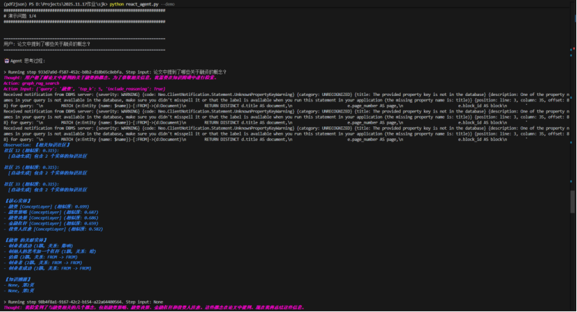
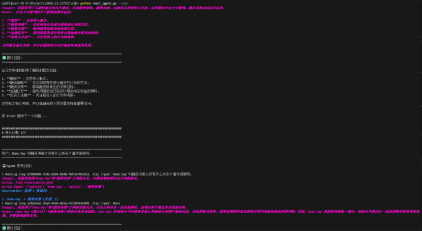
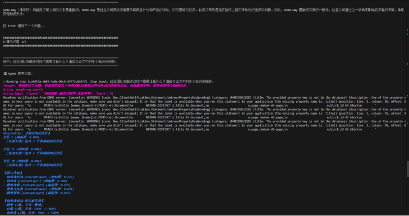
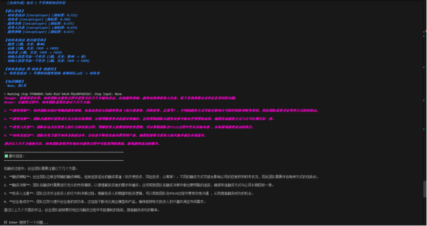

# Graph RAG 实践报告

## 1. KG 学习路径

- 采用 “与 GPT 的对话式自学” 模式，将 Neo4j 知识图谱拆解为 **实体 / 关系 / 属性 / 投影** 四大块。
- 反复追问本体建模与 Cypher 语法，在 30 分钟内梳理出 “PDF → 实体抽取 → 图谱建模” 的流水线。
- 最终沉淀出 6 层语义结构：`Document → Section → Concept → Process → Action → Entity`，作为后续所有脚本的统一 schema。

## 2. PDF 解析与三元组抽取

| 指标 | 数值 |
| --- | --- |
| PDF 数量 | 2（lesson6_1.pdf、早期创业融资指南-奇绩创坛.pdf） |
| 段落数量 | 48 |
| 抽取三元组 | 21 条 |
| 输出文件 | `data/outputs/triples_output.json` |

流水线：`parse_pdfs.py → extract_triples.py`，输出结构化 JSON。典型样本：

```json
{"subject":"融资策略","predicate":"帮助","object":"团队创造契机","page":1}
```

## 3. Docker + Neo4j 构建

1. 启动 `neo4j:5.18.0-enterprise` 与 `neo4j-gds:2.6.7`，映射数据卷 `./neo4j_data`。
2. 运行 `import_to_neo4j.py` 后，Neo4j Browser 中可见 **40 个实体节点、61 条关系**。
3. 可视化展示融资策略 → Demo Day → 创业者成功的多跳路径，验证建模正确性。


## 4. Graph RAG 与社区检测

- 使用 GDS Louvain 算法：

```cypher
CALL gds.louvain.write(
	'kg_graph',
	{
		relationshipWeightProperty: 'weight',
		writeProperty: 'communityId',
		tolerance: 0.0001,
		maxIterations: 50
	}
)
```

- 产出 **17 个社区**，同时注意到：
	- 需要 Neo4j 5.18 + GDS 2.6.7 的版本组合。
	- GDS API 中数组参数必须为列表形式（如 `seedNodeIds: [id]`），否则报错。
- 社区编号供三处使用：社区摘要输入、Qdrant community 向量、ReAct Agent 的 reasoning 上下文。

## 5. 社区摘要与混合检索

- `generate_community_summaries.py` 调用 Yunwu GPT-4o-mini，为 17 个社区生成 “主题 + 关键实体 + 洞察”。
- 针对没有 `Document.title` 的节点自动回退到 `file_name`，避免 Neo4j 警告。
- `graph_rag_tool.GraphRAGRetriever` 实现混合检索：
	1. Qdrant (`kg_entities` / `kg_relationships` / `kg_communities`) 做向量召回。
	2. 对最高分实体执行 `get_entity_neighbors` 与 `find_paths_between_entities`，补充多跳推理。
- 示例查询 “融资策略有哪些要点？” 返回相似度 **0.772** 的节点，并附带溯源页码。

## 6. ReAct 智能体对话

- `react_agent.py --demo` 启动 LlamaIndex ReActAgent + Graph RAG 工具链，完整输出 Reasoning / Action / Observation / Answer。
- 四个演示问题：
	1. 论文中涉及的融资概念（graph_rag_search）。
	2. Demo Day 与融资决策的联系（find_relationship_path）。
	3. 创业团队融资注意事项（混合检索 + 图推理）。
	4. 融资策略 / Demo Day / 创业者成功三者关联（直接推理）。







## 7. 问题记录与 Prompt 模板

- **主要问题**：Docker Desktop 下载极慢，改为离线镜像导入后恢复；其余阶段均保持 “vibe coding” 流畅节奏。
- **标准 Prompt 模板**（替换下列空白即可定义子任务）：

```
【使用 conda 的 py 虚拟环境，通过必要的依赖安装（例如 llamaindex）实现（_____）小项目：
1.目标：_____
2.要求：_____
2.1.输入：_____
2.2.输出：_____
2.3.技术栈：_____】
```

---

> 以上内容对齐了项目的七个阶段，便于回溯关键决策与踩坑细节。
