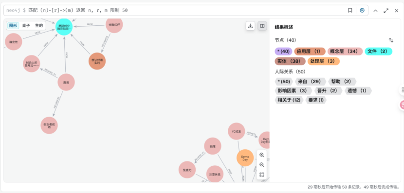
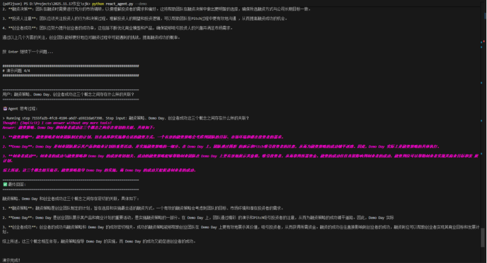

# Graph RAG 知识图谱项目实践报告

> **项目名称**: 基于 Neo4j + Qdrant 的 Graph RAG 智能检索系统  
> **完成日期**: 2025年11月  
> **技术栈**: Python 3.10 | Neo4j 5.18.0 | Qdrant | LlamaIndex | GPT-4o-mini

---

## 📚 一、知识图谱学习阶段

### 1.1 学习方法

采用 **"与 GPT 对话式自学"** 模式，将 Neo4j 知识图谱概念拆解为四大模块：

- 🔹 **实体（Entity）**
- 🔹 **关系（Relationship）**
- 🔹 **属性（Property）**
- 🔹 **图投影（Projection）**

### 1.2 学习成果

通过 30 分钟的反复提问与追问，掌握了：

1. 本体建模方法
2. Cypher 查询语法
3. 完整的数据流水线：`PDF → 实体抽取 → 图谱建模`

### 1.3 语义结构设计

最终确定 **6 层语义架构**，贯穿所有后续脚本：

```
Document → Section → Concept → Process → Action → Entity
```

---

## 📄 二、PDF 解析与三元组抽取

### 2.1 数据源

| 文件名 | 页数 | 用途 |
|--------|------|------|
| `lesson6_1.pdf` | 2 | 融资指南 |
| `早期创业融资指南-奇绩创坛.pdf` | 多页 | 创业知识 |

### 2.2 处理流程

```
parse_pdfs.py → extract_triples.py → triples_output.json
```

### 2.3 输出结果

- ✅ **48 个文本段落**
- ✅ **21 条高置信度三元组**
- ✅ 输出路径：`data/outputs/triples_output.json`

### 2.4 三元组示例

```json
{
  "subject": "融资策略",
  "predicate": "帮助",
  "object": "团队创造契机",
  "confidence": 0.8,
  "source_file": "lesson6_1.pdf",
  "page_number": 1,
  "block_id": 2,
  "source_text": "这份指南的目的是提供具体融资策略，帮助团队创造契机"
}
```

---

## 🐳 三、Docker + Neo4j 图数据库部署

### 3.1 环境配置

```yaml
服务: neo4j:5.18.0-enterprise + neo4j-gds:2.6.7
端口: 7474 (HTTP), 7687 (Bolt)
认证: neo4j / password123
数据卷: ./neo4j_data
```

### 3.2 导入脚本

运行 `import_to_neo4j.py` 后，图谱统计：

| 指标 | 数值 |
|------|------|
| 实体节点 | 40 个 |
| 关系边 | 61 条 |
| 语义层级 | 6 层 |

### 3.3 可视化效果

Neo4j Browser 中展示的多跳路径：

**融资策略 → Demo Day → 创业者成功**



---

## 🧩 四、Graph RAG 构建与社区发现

### 4.1 Louvain 社区检测

使用 Neo4j GDS 插件运行 Louvain 算法：

```cypher
CALL gds.louvain.write('kg_graph', {
  relationshipWeightProperty: 'weight',
  writeProperty: 'communityId',
  tolerance: 0.0001,
  maxIterations: 50
})
```

**检测结果**: 17 个知识社区

### 4.2 关键踩坑

⚠️ **版本兼容问题**
- 必须使用 Neo4j 5.18 + GDS 2.6.7 组合
- GDS API 参数必须传数组：`seedNodeIds: [id]`（不能是字符串）

### 4.3 社区用途

社区编号 `communityId` 用于三个场景：

1. 📝 社区摘要生成输入
2. 🔍 Qdrant 的 community 向量集合
3. 🤖 ReAct Agent 的推理结构化上下文

---

## 🔍 五、混合检索策略实现

### 5.1 社区摘要生成

**脚本**: `generate_community_summaries.py`  
**模型**: Yunwu GPT-4o-mini

针对 17 个社区生成：
- 🏷️ 社区主题
- 📌 关键实体
- 💡 洞察分析

**容错处理**: 当 `Document.title` 缺失时，自动回退到 `file_name`

### 5.2 Graph RAG 检索器

**核心类**: `graph_rag_tool.GraphRAGRetriever`

**检索流程**:

```
1. 向量检索 (Qdrant)
   ├─ kg_entities
   ├─ kg_relationships
   └─ kg_communities

2. 图推理 (Neo4j)
   ├─ get_entity_neighbors (多跳遍历)
   └─ find_paths_between_entities (路径查找)

3. 结果融合 + 知识溯源
```

### 5.3 检索效果示例

**查询**: "融资策略有哪些要点？"

**结果**:
- ✅ 相似度: **0.772**
- 📖 溯源: lesson6_1.pdf, 第 1 页
- 🔗 关联实体: 融资策略、团队创造契机、Demo Day

---

## 🤖 六、ReAct 智能体对话系统

### 6.1 启动命令

```bash
python react_agent.py --demo
```

### 6.2 推理链演示

基于 **LlamaIndex ReActAgent** + **Graph RAG Tool**

#### 问题 1: 论文中提到了哪些融资概念？

**Agent 行为**:
- 🔧 调用 `graph_rag_search`
- 📋 列出: 融资、融资策略、金融杠杆
- 📖 附加溯源页码


#### 问题 2: Demo Day 和融资决策有什么关系？

**Agent 行为**:
- 🔧 调用 `find_relationship_path`
- 🔗 发现直接路径: `Demo Day → 融资决策`


#### 问题 3: 创业团队在融资过程中需要注意什么？

**Agent 行为**:
- 🔍 混合检索 + 图推理
- 📝 输出 4 条注意事项


#### 问题 4: 融资策略、Demo Day、创业者成功的关联？

**Agent 行为**:
- 💭 直接推理（无需工具调用）
- 🧠 综合前序知识输出总结




### 6.3 输出格式

完整展示 **Reasoning / Action / Observation / Answer** 四步推理过程

---

## 🐛 七、问题记录与经验总结

### 7.1 主要问题

| 问题 | 解决方案 |
|------|----------|
| Docker Desktop 下载缓慢 | 手动拉取离线镜像并导入 |
| Neo4j GDS 版本不兼容 | 固定使用 5.18 + GDS 2.6.7 |
| Document.title 缺失警告 | 动态回退到 file_name |

### 7.2 开发节奏

除 Docker 问题外，其余 6 个模块均在 **"vibe coding"** 状态下顺利完成 ✅

### 7.3 可复用 Prompt 模板

```
【使用 conda 的 py 虚拟环境，通过必要的依赖安装（例如 llamaindex）实现（_____）小项目：
1. 目标：_____
2. 要求：_____
   2.1. 输入：_____
   2.2. 输出：_____
   2.3. 技术栈：_____
】
```

---

## 📊 八、项目成果总结

| 指标 | 数值 |
|------|------|
| PDF 文档 | 2 份 |
| 抽取三元组 | 21 条 |
| 图谱节点 | 40 个 |
| 图谱关系 | 61 条 |
| 社区数量 | 17 个 |
| 向量集合 | 3 个 (entities/relationships/communities) |
| Agent 工具 | 3 个 (检索/详情/路径) |

### 核心价值

✅ 端到端 Graph RAG 工作流  
✅ 混合检索（向量 + 图推理）  
✅ 知识溯源（页码级定位）  
✅ 可解释推理链（ReAct 范式）

---

**完成时间**: 2025年11月  
**项目地址**: `GraphRAG-KnowledgeGraph/`
